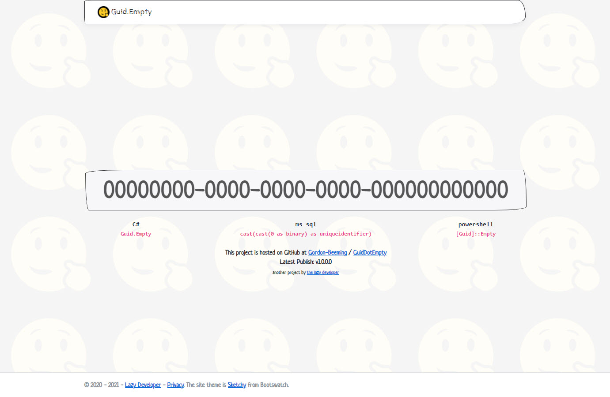

# Guid.Empty

A simple site just to easily get an empty Guid. This is a secure empty guid sent to you over https 😎.

Browse it at [https://00000000-0000-0000-0000-000000000000.xyz](https://00000000-0000-0000-0000-000000000000.xyz).

## Project Inactive

Built as a site to show you how to get an empty guid, was random and although the code will still be here, the site is off. To see the couple of ways the site showed you can open the page [src/GuidDotEmpty/Pages/Index.cshtml](src/GuidDotEmpty/Pages/Index.cshtml).

